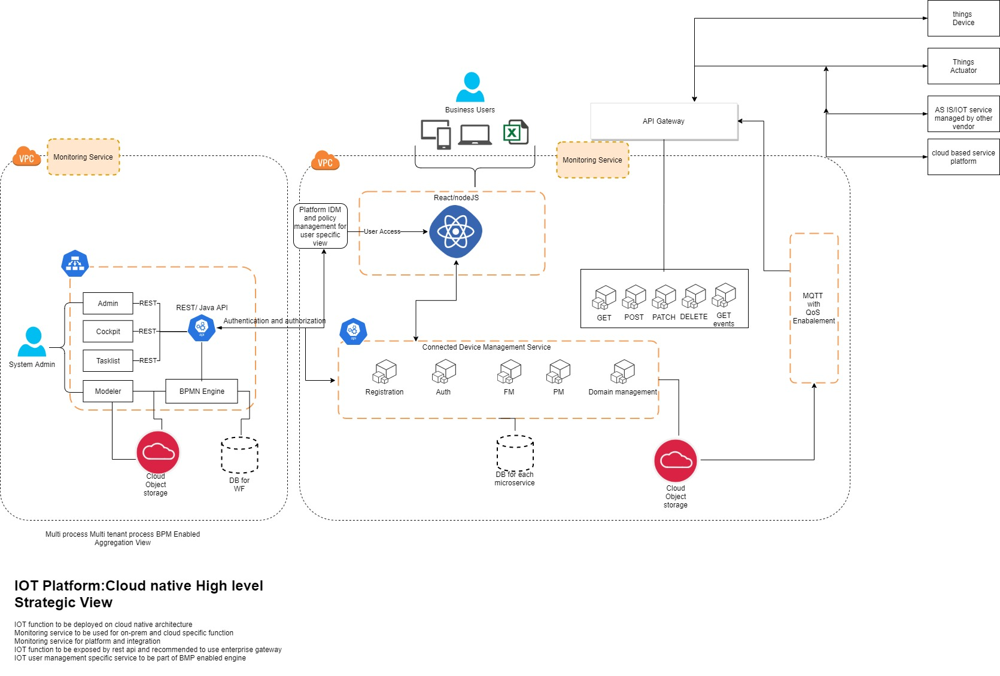
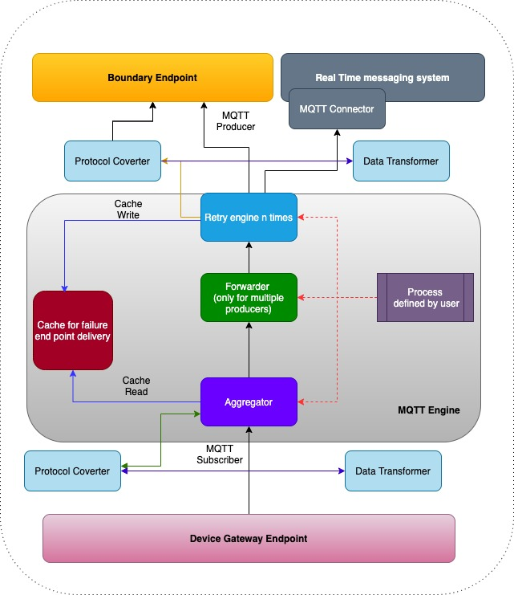
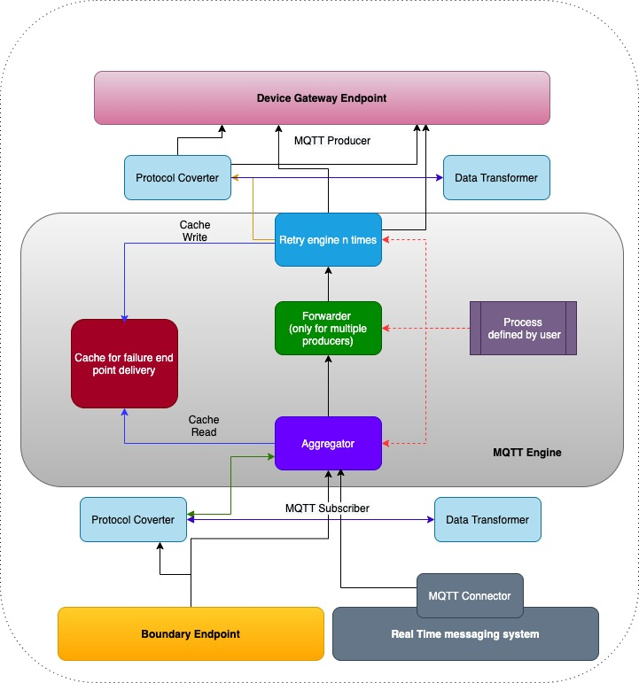
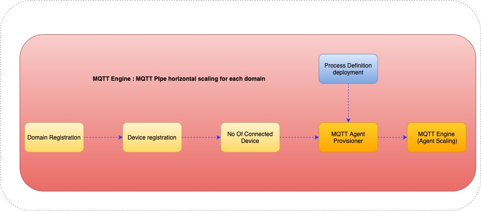
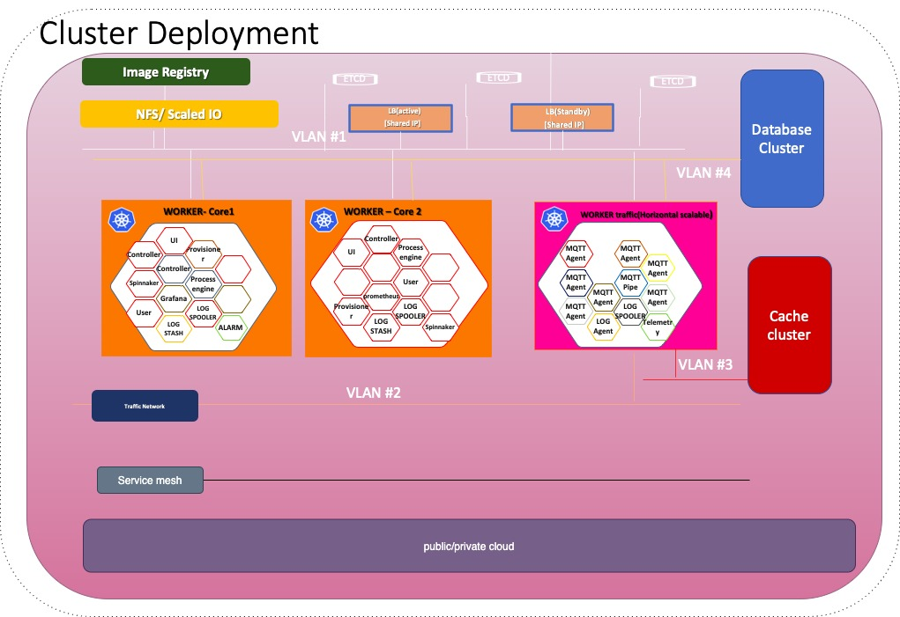

# Welcome to the kuhakT-open-source IOT platform

## Introduction
kuhakT is a open-source IOT platform, it has been designed in the view of following layers and can be tailored using organization specific requirements
the platform is designed for device to device /device to service/service to device or service/service communication.
* MQTT engine - a core component for light-weight message communication within platform framework
* Workflow engine - user specific process definition and deployment for managed device or service specific workflow
* Restful engine for device registration, authentication and domain registration
* Restful engine for device performance and fault management
* User interface to manage device, domain data management that include process definition for each device or across domain and end to end flow of each device,device profermance and fault managment that include alarm and performance key performance indicator monitoring

<c> Fig 1 kuhakT platform </c>

## concept
It has been designed to provide the view of managed devices(s),workflow engine for end to end data flow visualization, device to device boundary or device to service boundary or vice versa and device fault and performance in a single window.

### MQTT Core engine

c> Fig 2 kuhakT MQTT engine  managed device to boundary endpoint</c>

c> Fig 2 kuhakT MQTT engine   boundary endpoint managed device to</c>
### workflow engine
opensource workdflow engine to define and deploy end to end data follow
Data flow can be either applied to domain or each device
User specific view of the data visualizaion using corporate IDM/openid based authentication and authrization

### User interface
UI to visualize doman,data registration,authetication ,end to end data visualization that include device fault and perfromance managment

## Horizontal scaling of MQTT Agent

## Deployment architecture

